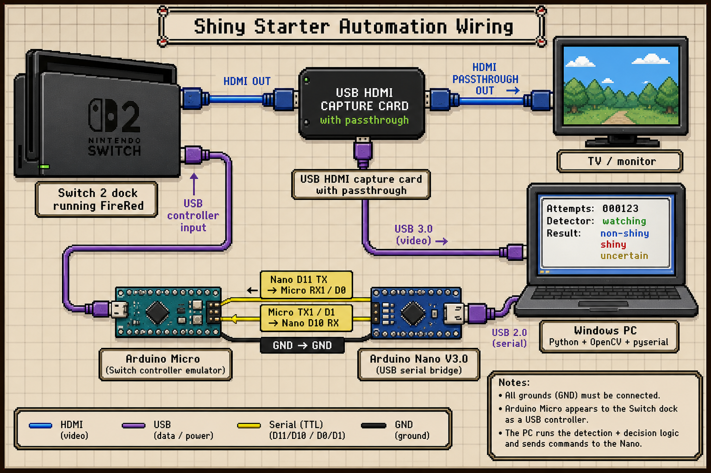

# Pokemon FireRed Shiny Starter Automation

This repo contains a first-pass fully unattended shiny starter hunting system for the Nintendo Switch release of Pokemon FireRed.

The system uses normal controller inputs and video capture only:

- Windows reads the USB HDMI capture feed.
- Python/OpenCV classifies the starter as `non_shiny`, `shiny`, or `uncertain`.
- The attempt counter is saved after every evaluated attempt.
- The Arduino Nano relays serial commands from Windows.
- The Arduino Micro sends Switch-compatible controller inputs.

Safety rule: `shiny` and `uncertain` both stop the automation.

## System Wiring



See [docs/wiring.md](docs/wiring.md) for the pin-by-pin wiring table and Mermaid diagram.

## Current Status

Implemented:

- Python detector core.
- Calibration JSON helpers.
- Attempt logging to JSON/CSV.
- Dry-run serial command recording.
- CLI entrypoint.
- Arduino Nano serial bridge sketch.
- Arduino Micro controller sketch.
- Wiring and setup docs.

Still needs physical calibration and timing adjustment on the real Switch/capture-card setup.

## Important Files

- `docs/setup.md`: end-to-end setup instructions.
- `docs/wiring.md`: pin-by-pin wiring instructions.
- `arduino/nano_bridge/nano_bridge.ino`: Nano bridge sketch.
- `arduino/micro_controller/micro_controller.ino`: Micro controller sketch.
- `scripts/shiny-hunt.py`: Windows CLI entrypoint.
- `shiny_hunter/`: Python package.
- `tests/`: Python unit tests.

## Run Tests

```powershell
python -B -m unittest discover -s tests -v
```

## Python Dependencies

```powershell
python -m venv .venv
.\.venv\Scripts\Activate.ps1
python -m pip install -r requirements.txt
```

## First CLI Checks

List capture devices:

```powershell
.\.venv\Scripts\python.exe scripts\shiny-hunt.py list-cameras --backend any
```

Save a calibration frame from the capture card:

```powershell
.\.venv\Scripts\python.exe scripts\shiny-hunt.py capture-frame --backend any --camera-index 2 --width 1920 --height 1080 --fps 30 --output calibration\starter-normal.png
```

Replace `2` with the capture-card or OBS Virtual Camera index reported by `list-cameras`.

Create a calibration from a saved normal-starter screenshot:

```powershell
.\.venv\Scripts\python.exe scripts\shiny-hunt.py calibrate-image --starter charmander --normal-image calibration\starter-normal.png --crop 444,282,258,284 --output calibration\charmander.json
```

Classify a screenshot:

```powershell
.\.venv\Scripts\python.exe scripts\shiny-hunt.py classify-image --calibration calibration\charmander.json --image calibration\starter-normal.png
```

Dry-run the loop without serial hardware:

```powershell
.\.venv\Scripts\python.exe scripts\shiny-hunt.py run --calibration calibration\charmander.json --backend any --camera-index 2 --width 1920 --height 1080 --fps 30 --dry-run --max-attempts 3
```

Check the Arduino controller bridge:

```powershell
.\.venv\Scripts\python.exe scripts\shiny-hunt.py controller-command --serial-port COM3 --command PING
```

The CLI waits briefly after opening the Nano serial port because opening `COM3` resets the Nano.
Hardware runs also wait for the Micro to report `READY_CHECK` before classifying the capture frame.
