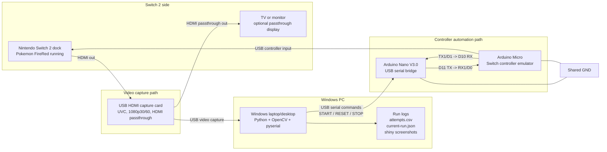

# Wiring Guide

## Complete System Diagram

Signal summary:

- Switch dock HDMI out goes into the capture card HDMI input.
- Capture card HDMI passthrough out goes to the TV or monitor.
- Capture card USB goes to the Windows PC for OpenCV frame capture.
- Windows PC USB goes to the Arduino Nano for serial commands.
- Nano D11 sends commands to Micro RX1/D0.
- Micro TX1/D1 sends optional status back to Nano D10.
- Nano GND and Micro GND must be connected.
- Arduino Micro USB goes to the Switch dock and acts as the controller.

## Devices

- Arduino Nano V3.0: plugs into the Windows computer over USB.
- Arduino Micro: plugs into the Switch 2 dock over USB.
- Ribbon/jumper wires: connect Nano serial pins to Micro `Serial1`.

## Recommended Wiring

Use the Nano as a USB-to-serial bridge with `SoftwareSerial`, not the Nano's hardware `TX/RX` pins. On most Nano V3.0 boards, the hardware UART is already tied to the USB serial chip, so D10/D11 keeps the bridge predictable.

| Signal | Arduino Nano | Arduino Micro | Purpose |
| --- | --- | --- | --- |
| Nano to Micro | D11 | RX1 / D0 | Windows command data to Micro |
| Micro to Nano | D10 | TX1 / D1 | Micro status data back to Windows |
| Ground | GND | GND | Shared signal reference |

## Connection Order

1. Leave both boards unplugged.
2. Wire Nano `D11` to Micro `RX1` / `D0`.
3. Wire Nano `D10` to Micro `TX1` / `D1`.
4. Wire Nano `GND` to Micro `GND`.
5. Upload `arduino/nano_bridge/nano_bridge.ino` to the Nano.
6. Upload `arduino/micro_controller/micro_controller.ino` to the Micro.
7. Plug the Nano into the Windows computer.
8. Plug the Micro into the Switch 2 dock.

## Sanity Checks

Before plugging the Micro into the Switch, test the serial path while the Micro is connected to the PC:

1. Open the Arduino Serial Monitor for the Nano.
2. Set the baud rate to `57600`.
3. Send `PING` with newline enabled.
4. The Micro should answer `PONG` if both sketches are loaded and wired correctly.

If there is no response:

- Confirm both boards share `GND`.
- Confirm Nano D11 goes to Micro RX1/D0.
- Confirm Nano D10 goes to Micro TX1/D1.
- Confirm the Serial Monitor is using `57600`.
- Confirm newline is enabled.

## Why The Nano Is Needed

The Micro's USB port is used as the Switch controller connection. The Nano gives the Windows script a separate serial path into the Micro so the PC can tell it when to start, reset, or stop.
